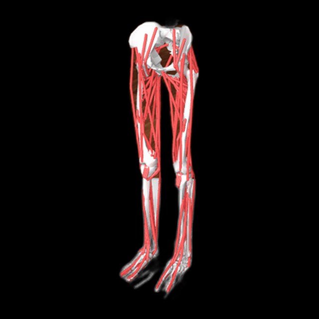
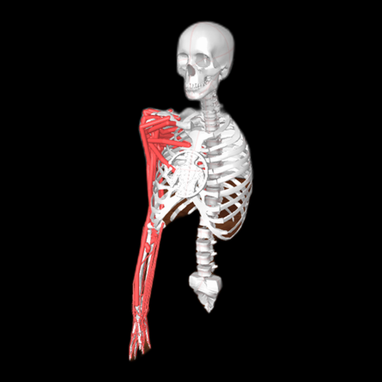
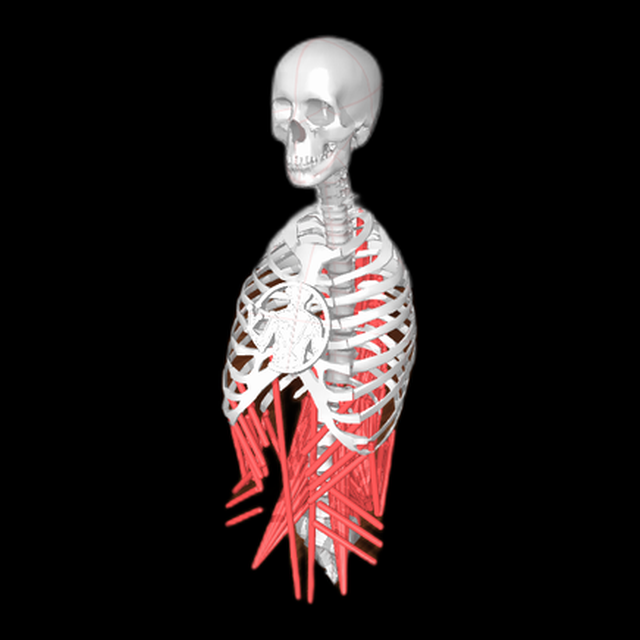
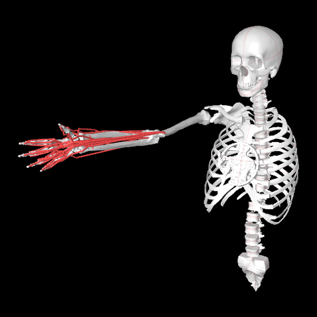
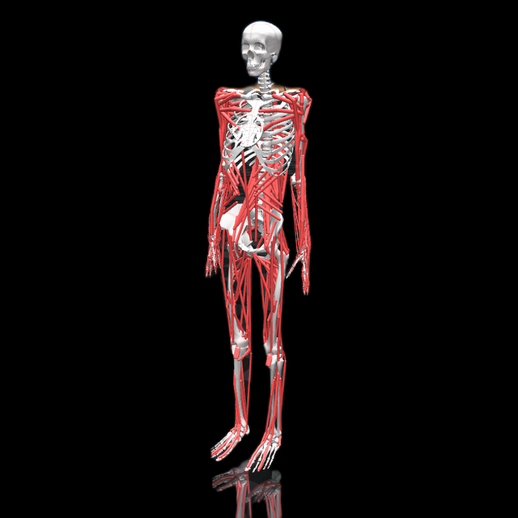
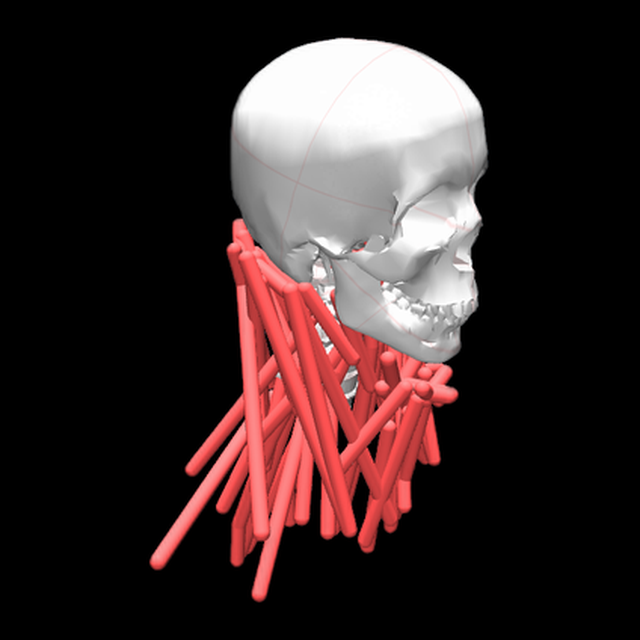
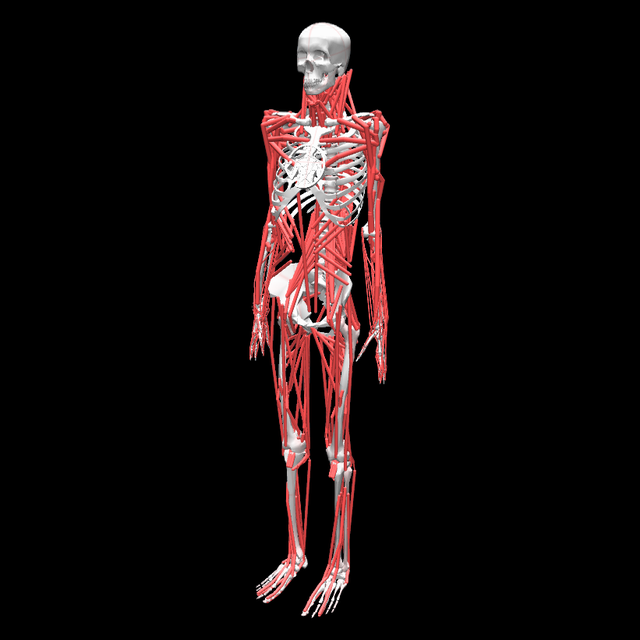
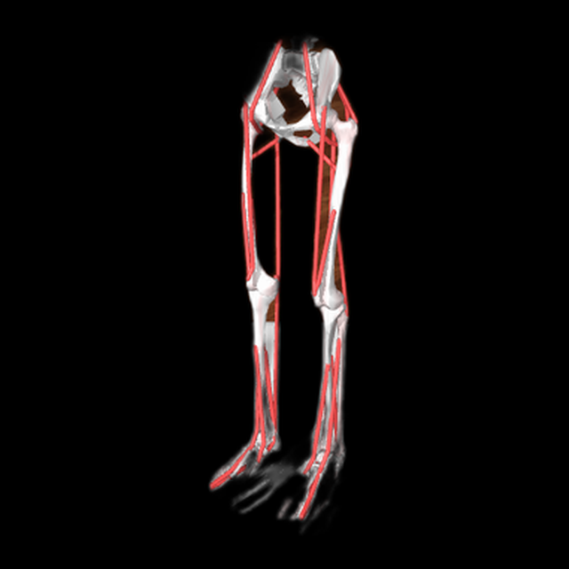

# MyoSim

[](https://github.com/MyoHub/myo_sim/actions/workflows/ci.yml)
[](LICENSE)
[](pyproject.toml)
[](https://pypi.org/project/myo-sim/)

MuJoCo musculoskeletal models for [MyoSuite](https://github.com/facebookresearch/myoSuite) — arm, leg, torso, hand, neck, and full body.

## Models

| [**MyoLeg**](myo_sim/models/leg/README.md)<br>`myolegs` | [**MyoArm**](myo_sim/models/arm/README.md)<br>`myoarms` | [**MyoTorso**](myo_sim/models/torso/README.md)<br>`myotorso` |
|:---:|:---:|:---:|
|  |  |  |
| 29 DoF · 80 muscles | 38 DoF · 63 muscles | 18 DoF · 210 muscles |

| [**MyoHand**](myo_sim/models/arm/README.md)<br>`myohands` | [**MyoFullBody**](docs/wiki/build-and-composition.md)<br>`myofullbody` | [**MyoHead**](myo_sim/models/head/README.md)<br>`myohead` |
|:---:|:---:|:---:|
|  |  |  |
| 23 DoF · 39 muscles | 123 DoF · 416 muscles | 24 DoF · 72 muscles · opt-in |

| [**Full body + neck**](myo_sim/models/head/README.md)<br>`myofullbody_neck` | [**MyoLeg26**](myo_sim/models/leg/README.md)<br>`myolegs26` |
|:---:|:---:|
|  |  |
| 147 DoF · 488 muscles · opt-in | 18 DoF · 26 muscles · beta |

Legacy (`myofinger`, `myoelbow`, `osl`) ships under [`myo_sim/models/legacy/`](myo_sim/models/legacy/README.md) for backwards compatibility only.

## Install

```bash
pip install myo-sim
```

## Quickstart

```python
import myo_sim

model, data = myo_sim.load("myolegs")
print(f"Joints: {model.njnt}, Muscles: {model.nu}")

from myo_sim.build.compose import build_model
model = build_model("myofullbody")
model_with_neck = build_model("myofullbody_neck")  # opt-in muscular neck
```

Other registered assemblies: `myotorso`, `myotorso_arms`, `myoarms`, `myohands`, `myolegs`, `myolegs26`, …
See [`docs/wiki/build-and-composition.md`](docs/wiki/build-and-composition.md).

```bash
uv run python -m myo_sim.build.compose --generate   # write XML snapshots under myo_sim/models/
```

## Development

```bash
git clone https://github.com/MyoHub/myo_sim.git
cd myo_sim
uv sync --dev
uv run pytest tests/ -x -n auto --ignore=tests/test_equivalence.py
```

See [CONTRIBUTING.md](CONTRIBUTING.md).

## Citation

```bibtex
@misc{MyoSuite2022,
  author    = {Caggiano, Vittorio and Wang, Huawei and Durandau, Guillaume
               and Sartori, Massimo and Kumar, Vikash},
  title     = {{MyoSuite}: A contact-rich simulation suite for musculoskeletal motor control},
  year      = {2022},
  doi       = {10.48550/ARXIV.2205.13600},
  url       = {https://arxiv.org/abs/2205.13600},
}
```

```bibtex
@article{Li2026MuscleMimic,
  title={Towards Embodied AI with MuscleMimic: Unlocking full-body musculoskeletal motor learning at scale},
  author={Li, Chengkun and Wang, Cheryl and Ziliotto, Bianca and Simos, Merkourios and Kovecses, Jozsef and Durandau, Guillaume and Mathis, Alexander},
  journal={arXiv preprint arXiv:2603.25544},
  year={2026}
}
```

## License

Apache 2.0 — see [LICENSE](LICENSE).
