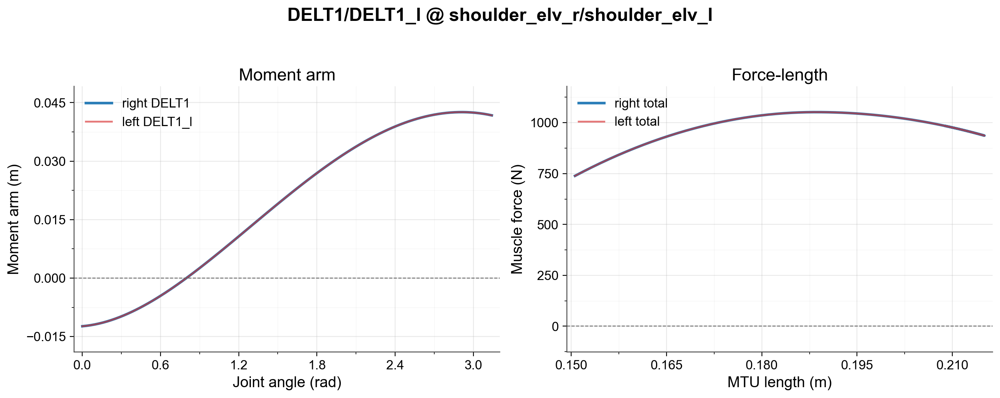

# MyoArm

MyoArm is a MuJoCo musculoskeletal model of the right upper extremity — shoulder girdle through hand — derived from the MoBL upper-extremity OpenSim model and the MyoHand model.

## Anatomical scope

| Property | Value |
|---|---|
| Degrees of freedom | 38 |
| Actuators (muscles) | 63 |
| Body segments | clavicle, scapula, humerus, radius, ulna, carpals (scaphoid, lunate, triquetrum, pisiform, trapezium, trapezoid, capitate, hamate), metacarpals (1–5), proximal/middle/distal phalanges (digits 2–5), thumb phalanges |
| Primary joints | shoulder (sternoclavicular, acromioclavicular, glenohumeral, scapulothoracic constraints), elbow flexion, forearm pronation/supination, wrist flexion/deviation, finger MCP/PIP/DIP (digits 2–5), thumb CMC/MCP/IP |

## Reference model

- **Source:** [MoBL Upper Extremity Dynamic Model](https://simtk.org/projects/upexdyn/)
- **Paper:** Holzbaur et al., 2005 ([DOI](https://doi.org/10.1007/s10439-005-3320-7))

## Fidelity

Example fidelity check (DELT1 left/right moment-arm and force-length plot) for symmetry and muscle jumping for upper limb. The full bimanual arm muscle check can be run with `tests/debug_muscle_bimanual.py`.

## Known limitations

- [ ] No open arm-specific issues at this time — see [all open issues](https://github.com/MyoHub/myo_sim/issues)

## Manual adjustments

- Post-conversion adjustments to kinematic and dynamic behaviors to correct abnormal results from the automatic pipeline.
- Contact geometries manually designed with anatomical references; contact properties optimized for contact-rich behaviors.
- Muscle parameters updated during the 2026-05 refactor to improve force-length accuracy.

## Changelog

**2026-08-02** — Restored anatomical optimal fiber length (`L0`), tendon slack length (`LT`), and peak isometric force (`Fmax`) from the MoBL-ARMS reference for 7 of 8 inflated shoulder muscles (`TMIN`, `LAT2`, `INFSP`, `BICshort`, `TRIlong`, `SUPSP`, `PECM1`; `CORB` left unfixed pending a proper functional-ROM audit — its excursion/`L0` ratio matches the pattern that predicted a force-accuracy regression for 4 leg muscles) and all 24 inflated hand-extrinsic muscles (finger/wrist flexors and extensors), which had never received per-muscle calibration at all — every one compiled against MuJoCo's raw default `range="0.75 1.05"`. Also incidentally corrected a pre-existing `SUPSP` inconsistency where `gainprm` and `biasprm` held different values from each other. No arm/hand equivalent of the leg's gait-ROM force-accuracy cross-check exists yet, so these fixes are `L0`-matched-only, not independently force-validated the way the leg fixes are. Verified against `myoElbowPose1D6MRandom-v0` and `myoHandReachRandom-v0` in myosuite4 (random-action rollouts, no NaN/instability). See `docs/wiki/log.md` (2026-08-02 entries) for full detail.

**2026-06-29** — Compared MyoArm-derived full-body geoms against the previous MuscleMimic full-body model. The old reference contained non-collision wrap geoms `APL_torus_wrap_left` on `hamate_l`, `FCU_wrap_left` on `pisiform_l`, and `Trpzm_wrap_left` on `trapezium_l`; these are intentionally absent from the current MyoArm XML as they were never used. Removed `distph2_r_coll_2` from the required parity list because it duplicated the unnamed ellipsoid already present on `distph2_r`.

**2026-06-05** — Moved chest ownership to myotorso; added unit tests.

**2026-06-03** — Refactored model structure and enhanced asset management.

**2026-05-27** — Added contact XML; refactored arm model structure and updated muscle parameters.

**2026-05-25** — Removed redundant left arm; left arm now mirrored via mjspec. Hands extracted from arms via mjspec.

**2023-12-26** — Initial XML release of myoarm models.

## Citation

See repository README.
