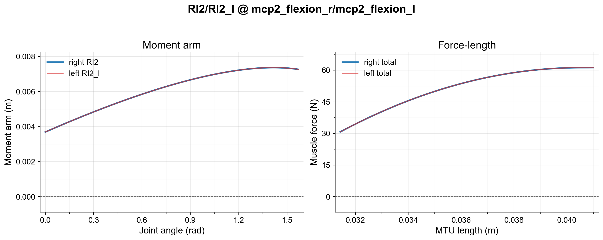

# MyoHand

MyoHand is a MuJoCo musculoskeletal model of the right wrist and hand, derived from the MoBL upper-extremity OpenSim model and the 2nd-Hand model.

## Anatomical scope

| Property | Value |
|---|---|
| Degrees of freedom | 23 |
| Actuators (muscles) | 39 |
| Body segments | radius, ulna, carpals (scaphoid, lunate, triquetrum, pisiform, trapezium, trapezoid, capitate, hamate), metacarpals (1-5), proximal/middle/distal phalanges (digits 2-5), thumb phalanges |
| Primary joints | forearm pronation/supination, wrist flexion/deviation, thumb CMC/MCP/IP, finger MCP/PIP/DIP (digits 2-5) |

## Reference model

- **Source:** [MoBL Upper Extremity Dynamic Model](https://simtk.org/projects/upexdyn/) and [2nd-Hand](https://simtk.org/projects/hand_muscle)
- **Paper:** Holzbaur et al., 2005 ([DOI](https://doi.org/10.1007/s10439-005-3320-7))

## Fidelity

Example fidelity check (RI2 left/right moment-arm and force-length plot) for symmetry and muscle jumping for hand model. The full hand arm muscle check can be run with `tests/debug_muscle_bimanual.py`.

## Known limitations

None currently tracked.

## Manual adjustments

- Adjustments post conversion to optimize for kinematic and dynamic behaviors.
- Inertial properties.
- Dynamics properties of the joints.
- Contact geometries manually designed with references.
- Contact properties optimized for contact-rich behaviors.

## Changelog

**2026-06-17** — Moved the hand README under the arm model folder and refreshed it to the standard model README format.

**2026-06-16** — Added MyoHand equivalence coverage and documented MjSpec hand composition.

**2026-06-04** — Initial MyoHand README described the MoBL and 2nd-Hand reference models and conversion process.

## Citation

See repository README.
