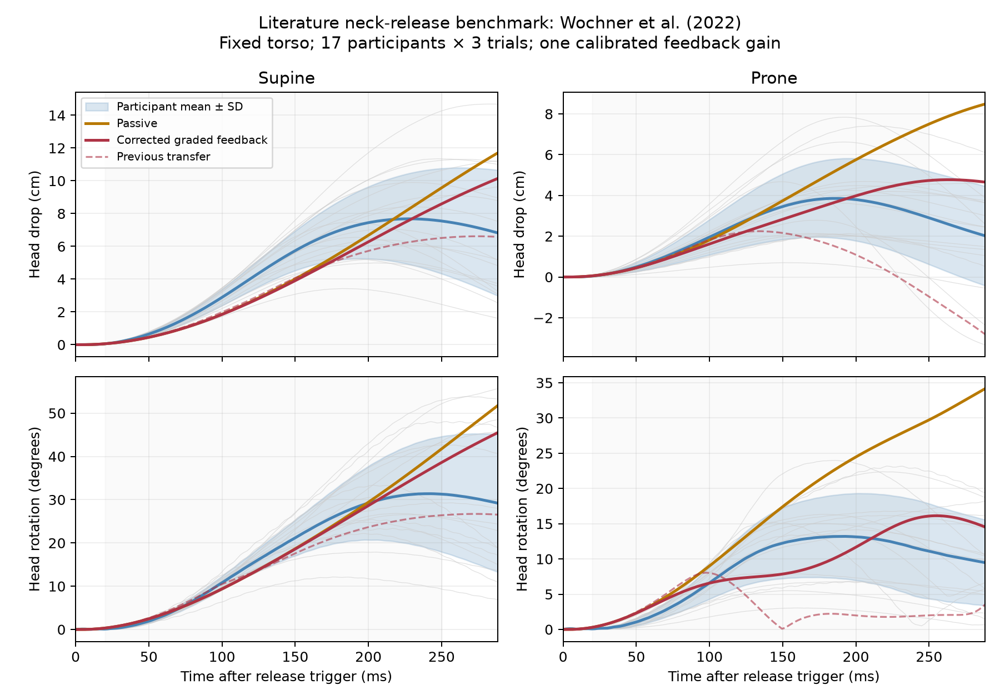
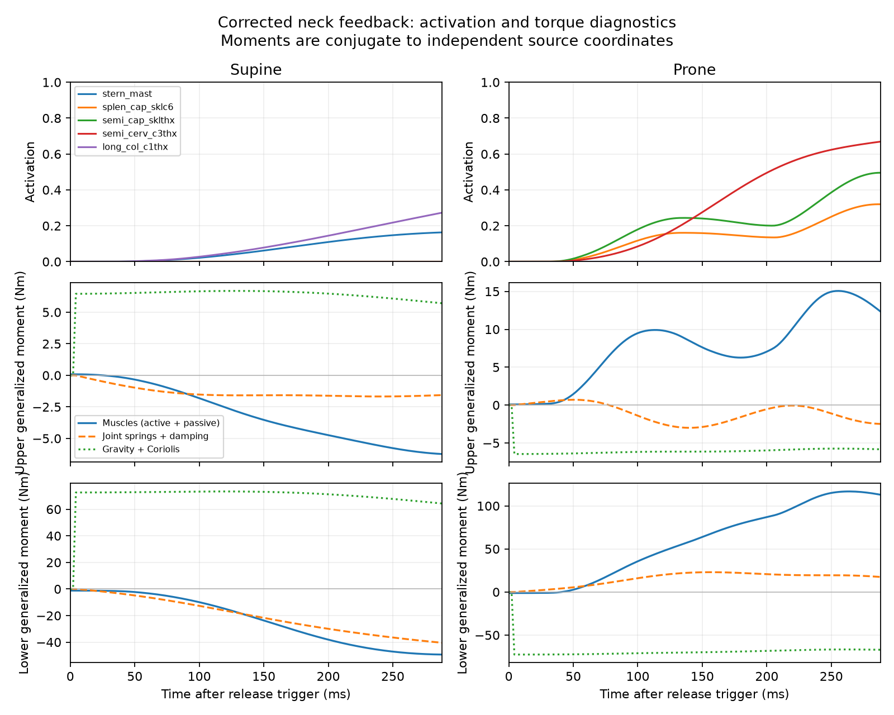

# Neck validation

`results.json` is the measured acceptance report for `myohead` and
`myofullbody_neck`. Run from the repository root:

```bash
uv run python scripts/validate_neck.py
uv run pytest tests/test_neck_validation.py
```

This combines **source path verification, neutral isometric agreement and a
calibrated dynamic literature benchmark**. Neutral strength values were already
used to calibrate the HYOID source. The validation-only dynamic controller is
calibrated on nine participants and evaluated separately on eight, as described
below. Production muscle parameters are not fitted to these trajectories.
Individual muscle force–length/velocity curves, injury response and the complete
full-body model are not independently validated.

## Sources and reproduction

The model source is Mortensen, Vasavada and Merryweather's scaled HYOID model
([2018 paper](https://doi.org/10.1371/journal.pone.0199912),
[SimTK](https://simtk.org/projects/neckdynamics)), distributed under the retained
MIT notice in `LICENSE.Neck6D`. MyoConverter stores the source model and its
converted muscle parameters. `provenance.json` pins the checkout and input
SHA-256 hashes; `opensim_reference.json` records the actual OpenSim version,
source hash, units, sampling protocol and exported fixture checksum.

```bash
git clone https://github.com/MyoHub/myoconverter /tmp/myoconverter-neck
git -C /tmp/myoconverter-neck checkout cadf38059367a51239e6dc28c9fbe8b8fbd5149f
uv run python scripts/import_neck_source.py /tmp/myoconverter-neck
# OpenSim is an optional export dependency, not a package/runtime dependency.
uv pip install opensim==4.6
uv run python scripts/validate_neck.py --export-source \
  /tmp/myoconverter-neck/models/osim/Neck6D/HYOID_1.2_ScaledStrenght_UpdatedInertia_adjusted.osim
uv run python scripts/validate_neck.py
```

The committed reference contains fresh OpenSim measurements of 72 muscles at
729 poses: the Cartesian product of minimum, neutral and maximum values of six
independent source coordinates. The order is `pitch1, roll1, yaw1, pitch2,
roll2, yaw2`, in radians. Lengths are metres; signed moment arms are
`-d(length)/d(independent coordinate)`, including all 18 source couplings.
The reference exporter sets dependent coordinates explicitly to the source
coupling functions rather than allowing assembly to perturb requested poses.

Both models must agree with the **canonical right source and its sagittal
reflection** within 1 mm in length and signed moment arm. The repo requires
right-only authoring and generated left muscles. Under reflection, pitch is
unchanged and roll/yaw change sign, for both upper and lower coordinates.
The original source's left muscles have small attachment asymmetries, notably
Geniohyoid. Their maximum difference is also reported, separately; it is not
hidden, fitted away, or counted as evidence of identical bilateral anatomy.
Measured maxima are 0.0059 mm in length and 0.0426 mm in moment arm for the
canonical comparison, versus 2.6613 mm against the original asymmetric left.

The tests additionally compare analytic tendon derivatives to centered finite
differences at interior multi-coordinate poses (10⁻⁸ m/rad tolerance), check
bilateral lengths and actuator parameters, require nonnegative inferred tendon
slack, and verify unchanged full-body actuator parameters, head/collision
landmarks and sensor names. Fixtures are checksum-verified and loaded without
pickle; nonfinite measurements fail.

## Experimental comparison

`neutral_strength.csv` records the male means and SDs from Vasavada, Li and
Delp, 2001 ([primary study](https://pubmed.ncbi.nlm.nih.gov/11568704/), DOI
10.1097/00007632-200109010-00018), also tabulated in Mortensen 2018, Table 3.
Acceptance is mean ± one SD, specified before the integrated measurements.
It is a descriptive agreement bound, not a confidence interval.

The simulation follows Mortensen's helmet-load reconstruction: horizontal load
20 cm above the skull–C1 joint; force is multiplied by the published 32 cm lever
arm to report a C7–T1 moment. Axial rotation uses a pure superior-axis moment.
Vasavada resolves experimental moments at the midpoint of the C7 spinous process
and sternal notch, approximated here by Mortensen's C7–T1 convention.

A linear program maximizes the external load, with activation bounded [0, 1],
while simultaneously balancing all six cervical coordinates. It includes
neutral gravity and passive muscle forces, with no reserve actuators. This
uses a maximum feasible load objective, rather than Mortensen's activation²
static-optimization objective. All other full-body coordinates are prescribed;
this tests cervical capacity in the composed body, not whole-body balancing.

| Direction | Composed neck (Nm) | Experiment mean ± SD (Nm) |
|---|---:|---:|
| Flexion | 29.40 | 30 ± 5 |
| Extension | 44.31 | 52 ± 11 |
| Lateral bending | 37.91 | 36 ± 8 |
| Axial rotation | 12.83 | 15 ± 4 |

All four pass. Standalone and integrated values differ by less than 10⁻⁸ Nm.
The largest equilibrium residual is below 10⁻¹² Nm. These results complement
the existing full-body regression tests; the original `myofullbody` remains
123 joints and 416 actuators.

## Model adjustments and limits

- The converted XML omitted source child-frame joint-center offsets. They are
  restored directly from the adjusted OpenSim file; body offsets also use the
  exact source values. No joint centers were fitted to force data.
- Midline vertebrae retain converted inertias, source joint axes, ranges and couplings.
  The model has 24 rotational coordinates and 18 constraints: six independent
  cervical DoFs, plus 72 generated bilateral actuators.
- Thoracic, clavicular and scapular muscle landmarks are transformed into the
  existing torso's fixed `head_attach` frame. They do not follow the separately
  articulated MyoSim shoulders; no duplicate thorax/shoulder bodies or muscles
  are added. This limits shoulder–neck interaction fidelity.
- Muscle parameters retain the right cvt3 conversion, except Geniohyoid: its
  fitted range implied −64.8 mm tendon slack. Its source L0 = 34.3 mm,
  LT = 5.42 mm and F0 = 91.665 N replace that fit, with MuJoCo's standard muscle
  curve. Other conversion parameters are approximate, not independent
  measurements of physiological fiber/tendon properties.
- Source rotational bushing stiffness and damping are now represented with native
  joint springs/damping: exact in the sagittal benchmark, a first-order
  approximation to the source's XYZ Euler bushings during multi-axis motion.
  There are no translational bushing forces in the source. The generic 0.05
  joint damping is replaced, not added to the source damping. The jaw is welded;
  compliant OpenSim tendon force dynamics remain absent from production assets.
- Converted cervical inertias are isotropic 0.04 kg m². The source tensors
  (0.02, 0.08, 0.02) violate the inertia triangle inequality; conversion balances
  them. These are retained without fitting, not verified anatomical inertias.
  Experimental force–length/velocity validation has not been performed.
- Only existing HAT anatomy meshes are used. The seven largest connected shells
  of `hat_cervical.stl`, sorted by superior Y centroid, define C7–C1; smaller
  fragments are assigned to the nearest shell. All 2,689 triangles are retained.
  This mesh labeling is heuristic; it does not validate anatomical registration.
  Mesh local transforms preserve the existing neutral appearance exactly.
- The neutral skull origin is aligned to the existing head at (0, 0.5, 0) in the
  torso attachment frame. New source head/neck mass is 7.71892 kg; the opt-in
  full body is 89.60644 kg (default is 84.26499 kg). This changes inertia and
  dynamics in the opt-in variant. Default training checkpoints retain the
  existing rigid model and its action/observation layout.

## Dynamic experimental benchmark

The reference is Wochner, Nölle, Martynenko and Schmitt (2022),
[“Falling heads”](https://doi.org/10.1186/s12938-022-00994-9).
Measured trajectories are from [DARUS-1132 v1.1](https://doi.org/10.18419/DARUS-1132),
CC BY 4.0. Processing conventions were checked against the authors'
[A0, A3 and A10 scripts](https://doi.org/10.18419/DARUS-2526).
These measurements are independent of the HYOID source's strength calibration.

```bash
uv run --frozen python scripts/validate_neck_dynamics.py
uv run --frozen pytest tests/test_neck_dynamics.py
# Rebuild measurements from the publisher's downloaded ZIP:
uv run --frozen python scripts/validate_neck_dynamics.py --import-data /path/to/ExtractedTrajectories
# Optional OpenSim-only export of anatomical properties and tendon curve:
uv run --frozen python scripts/validate_neck_dynamics.py --export-physiology \
  /path/to/HYOID_1.2_ScaledStrenght_UpdatedInertia_adjusted.osim
# Reproduce training-only gain selection after changes to inputs:
uv run --frozen python scripts/validate_neck_dynamics.py --calibrate
```

All normal runs are offline. The importer checks publisher MD5s, then stores the
supplied time and marker 1/2 coordinates in `falling_heads.npz`. Normal runs check
its SHA-256. All 51 trials per direction are retained: 17 participants, three
repeats, no exclusions or synthetic reference curves. Marker 2 is a head COM
proxy; marker 1–2 orientation gives unsigned angular displacement, as in A3.
Time, displacement and orientation are zeroed at release frame 17, rather than
A0/A3's first-frame baseline. Three repeats are averaged for each participant
before computing the group mean/sample SD (A10). Coordinates are used as
supplied, without extra filtering, differentiation or acceleration claims.

### Mechanical and controller corrections

The initial binary-controller transfer failed prone displacement and rotation.
`dynamic_baseline.json/.npz` preserve that result and its experimental checksum.
Diagnostics identified excessive upper-neck extension opposing lower flexion.
Three representation issues were corrected:

1. The anatomical source's rotational stiffness/damping was omitted. The source
   generator now restores it using native joints, without callbacks or new
   production dependencies. These springs are exact for sagittal release and
   linearized for general multi-axis motion. Neutral strength is unchanged.
2. Fitted MuJoCo force parameters were being treated as anatomical tendon slack.
   Some implied resting fibers were much shorter than in the source, amplifying
   spindle strain. `neck_physiology.json/.npz` instead export source L0, LT,
   pennation, maximum force and the actual OpenSim tendon force–length curve.
   The controller estimates tendon elongation from simulated tension, subtracts
   it from musculotendon length, and reconstructs CE length with constant-width
   pennation. This is a **fiber observer**, not compliant tendon dynamics added
   to the MuJoCo force law. It is checksum-pinned and needs OpenSim only to export.
3. The original transfer stimulated muscles absent from the paper's neck set.
   `controller_muscle_families.json` maps 24 source muscles per side to the
   published [DARUS-1145 v1.1](https://doi.org/10.18419/DARUS-1145) families.
   Forty-eight actuators receive feedback. Trapezius, levator scapulae and the
   unmatched hyoid muscles receive no controller stimulation; all 72 retain
   their normal passive forces and remain available in production.

Restoring bushings or changing only the binary threshold was insufficient.
The binary controller (Table 5) remains reproducible as `controller="binary"`
and is reported separately. The accepted controller uses the paper's **graded
length feedback** (Eq. 13), bounded to [0,1]:

`stimulation = clip(kp * (delayed_CE_length - relaxed_CE_length) / source_L0, 0, 1)`

The 25 ms sensory delay is retained; the authors' EHTM code also delays the
length input to lambda feedback. MuJoCo's own activation dynamics are integrated.
The source paper's kp = 15.49 example belongs to a different muscle model;
our one shared gain is explicitly calibrated, not claimed as its direct reuse.
The binary threshold remains 5% for the diagnostic comparison.

### Calibration and evaluation

Odd-numbered participants (1,3,…,17; n=9) provide the training corridor. The
selection function accesses no even-participant trajectories. It tests gains
2–20 in steps of 0.25 and chooses the **lowest gain meeting all four training
RMS criteria**, to avoid unnecessarily strong feedback. Gain 3.25 fails prone
training displacement; gain **3.5** is the first feasible value. No per-direction
or per-muscle gains, muscle-force retuning, trajectory tracking or reserve
actuators are used. `neck_feedback_calibration.json` records every candidate,
participant IDs and hashes of inputs, assets and implementation. Changed inputs
invalidate the calibration until it is reproduced.

Even-numbered participants (2,4,…,16; n=8) are evaluated separately after
selection. **This is exploratory, participant-separated evaluation, not blinded
validation:** earlier development inspected full-cohort curves. Controller
architecture and the least-gain selection rule were chosen during that work.
All measured reference arrays, the original 20–250 ms window and descriptive
acceptance bounds remain unchanged.

The criterion is displacement **and** rotation RMSE ≤ RMS between-participant SD
in each direction. It is a descriptive convention chosen here, not a published
tolerance or confidence interval. Pointwise corridor coverage is also reported;
RMS agreement does not require every sample to lie within one SD.

| Graded feedback | Drop RMSE (cm) | Rotation RMSE (degrees) | Drop / SD RMS | Rotation / SD RMS | Criterion |
|---|---:|---:|---:|---:|---|
| Supine, all 17 | 1.136 | 2.29 | 0.725 | 0.373 | Pass |
| Prone, all 17 | 0.620 | 2.64 | 0.421 | 0.589 | Pass |
| Supine, evaluation 8 | — | — | 0.609 | 0.327 | Pass |
| Prone, evaluation 8 | — | — | 0.609 | 0.950 | Pass |

The initial prone errors were 1.857 cm and 7.90 degrees. All four training,
all-participant and evaluation criteria now pass. Evaluation prone rotation is
close to its bound; this is limited support for the benchmark, not proof of
population-wide validity. Passive and binary-controller results remain visible
as diagnostics. The CLI returns nonzero on engineering, all-participant or
evaluation failure; pytest tests numerical correctness rather than asserting
biological acceptance.

Numerical checks pass at 0.125 ms. Halving the timestep changes displacement by
at most 0.014 mm and rotation by 0.0061 degrees. Maximum soft coupling residual
is 0.000060 rad. Standalone and fixed-torso integrated responses agree within
10⁻⁸ m/rad. `dynamic_trajectories.npz` additionally records every actuator's
activation, stimulation, signed tension and observed CE strain, plus six
independent-coordinate muscle, passive-joint and gravity/Coriolis moments and
positions. Column names and actuator names are in `dynamic_results.json`.
Muscle moments include active and passive muscle contributions; they do not
include native joint springs. Generalized moments are conjugate to independent
coordinates, not net moments about the skull.





### Scope

The private validation spec fixes non-cervical joints and disables contact.
Gravity is oriented into the initial skull frame for supine/prone release;
neutral posture, zero activation and zero velocity are initial conditions.
Support lasts for the paper's 4 ms release delay, then the neck moves freely.
Measured motion never prescribes simulated positions or stimulation.

Settling against the trapdoor, contact mechanics, torso movement and individual
anatomy are not reproduced. Participants were not torso-restrained, and the
single scaled model is compared with a mixed-sex, mixed-age cohort. Source
converted inertia and approximate muscle force curves remain limitations.
The observer estimates fiber length from a compliant source curve while
production force dynamics still use rigid tendons. The source bushing mapping
is approximate outside the sagittal plane. Later supine recovery beyond the
20–250 ms acceptance window is visibly imperfect; plotted samples outside it
are diagnostic, not accepted by this criterion. Whole-body balancing,
shoulder–neck interaction, EMG onset, acceleration and injury response remain
unvalidated by these results.
