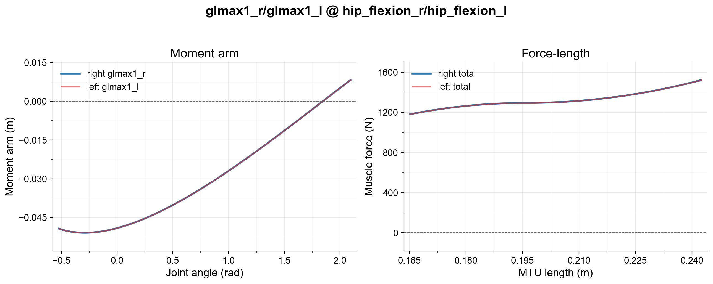

# MyoLeg

MuJoCo musculoskeletal model of the bilateral lower extremity, derived from Rajagopal et al.'s full-body gait model.

## Anatomical scope

| Property | Value |
|---|---|
| Degrees of freedom | 29 |
| Actuators (muscles) | 80 |
| Body segments | calcn_l, calcn_r, femur_l, femur_r, patella_l, patella_r, pelvis, talus_l, talus_r, tibia_l, tibia_r, toes_l, toes_r |
| Primary joints | hip_flexion, hip_adduction, hip_rotation, knee_angle, ankle_angle, subtalar_angle, mtp_angle (bilateral) |

## Reference model

- **Source:** [Rajagopal Full-Body Musculoskeletal Model](https://simtk.org/projects/full_body)
- **Paper:** Rajagopal A, Dembia C, DeMers M, Delp D, Hicks J, Delp S (2016). Full-Body Musculoskeletal Model for Muscle-Driven Simulation of Human Gait. IEEE Transactions on Biomedical Engineering. ([DOI: 10.1109/TBME.2016.2586891](https://doi.org/10.1109/TBME.2016.2586891))

## Fidelity

Example fidelity check (glmax1 left/right moment-arm and force-length plot) for symmetry and muscle jumping for lower limb. The full leg muscle check can be run with `tests/debug_muscle_leg.py`.

## Known limitations

- [ ] #64 — `myoleg` naming used inconsistently across the repository
- [ ] Endpoints (markers) below the knee joints have approximately 1 cm position differences between the converted MuJoCo and OpenSim model. This may be due to the polynomial approximation of the OpenSim lookup table for knee translation degrees of freedom.
- [ ] Vastus muscle moment arms at the knee joint have relatively large differences (same sign, a few cm). This may be caused by the dependent joint constraints at the knee and also affects knee extensor muscle force.
- [ ] Muscle forces are not identical between the converted MuJoCo and OpenSim models due to differences in muscle model definitions (stiff vs. elastic tendons). Opt-in series-elastic tendon support is available via `myo_sim.build.elastic` (see `docs/wiki/build-and-composition.md`) for the Achilles group (soleus/gasmed/gaslat); validated against the OpenSim/Millard analytic reference and against published in-vivo human tendon strain data (Finni et al. 2003; Farris et al. 2013; Obst et al. 2014/2016; Magnusson et al. 2003) — see `sandbox/elastic_tendon/` for the validation study. Not wired into the default `myolegs` model.
- [ ] Muscle moment arms in the reference OpenSim model contain sudden changes (wrapping path jumps), which required the manual adjustments described below.

## Manual adjustments

- Removed wrapping objects for glmax1_l, glmax2_l, glmax1_r, glmax2_r, psoas_l, and psoas_r to prevent wrapping path jumping. Objects removed: Gmax1_at_pelvis_l_wrap, Gmax2_at_pelvis_l_wrap, Gmax1_at_pelvis_r_wrap, Gmax2_at_pelvis_r_wrap, PS_at_brim_l_wrap, PS_at_brim_r_wrap.
- Changed wrapping object type from `cylinder` to `sphere` for iliacus_l and iliacus_r (IL_at_brim_l_wrap, IL_at_brim_r_wrap) to prevent wrapping path jumping.
- Adjusted `lmin` of gaslat_l, gaslat_r, semimem_l, and semimem_r from 0.1 to 0.05 to prevent negative muscle forces.
- Post-conversion adjustments to kinematic and dynamic behaviors, inertial properties, and joint dynamics properties.
- Contact geometries based on the [Yeadon measurement method](https://yeadon.readthedocs.io/en/latest/measurements.html#measurements), slightly adjusted to fit the MuJoCo MSK model. Contact properties were optimized for contact-rich behaviors.

## Changelog

**2026-08-02** — Restored anatomical optimal fiber length (`L0`), tendon slack length (`LT`), and peak isometric force (`Fmax`) from Rajagopal2016.osim for 6 of the 10 muscles whose `L0` was inflated >1.2x due to an oversized `lengthrange` (`bflh_r/_l`, `gasmed_r/_l`, `tfl_r/_l`, `glmin3_r/_l`, `piri_r/_l`, `semimem_r/_l`), after remeasuring `lengthrange` over a physiological gait-ROM sample (`sandbox/elastic_tendon/leg_param_audit.py`). `recfem_r/_l`, `vasint_r/_l`, `vaslat_r/_l`, and `glmax3_r/_l` were deliberately left unchanged — cross-checking against the OpenSim Millard force prediction showed anatomical retuning *increases* their force error (`sandbox/elastic_tendon/refit_experiment.py`), so the current values are kept despite their `L0` mismatch. Also added opt-in Achilles elastic-tendon support (see the limitations note above). Verified against `myoLegStandRandom-v0`/`myoLegWalk-v0` in myosuite4 (random-action rollout, no NaN/instability). See `docs/wiki/log.md` (2026-08-02 entries) for full detail.

**2026-06-04** — Refactored model loading to use updated leg model XML; added muscle symmetry checks and contact assertion tests.

**2026-06-03** — Refactored model structure and enhanced asset management.

**myoleg_v0.56 (mj237)** — Adjusted height field; migrated to MuJoCo 2.3.7.

**myoleg_v0.53 (mj120)** — Improved collisions; added height field.

**myoleg_v0.52 (mj120)** — Removed extra body that made the torso twice as heavy; body mass is now approximately 80 kg.

**myoleg_v0.51 (mj120)** — Added new keyposes to mark convenient poses.

## MyoLeg26 (reduced 26-muscle legs + passive torso)

`myolegs26` pairs the passive anatomical torso scaffold (no arms, no torso muscles) with a reduced
26-muscle leg chain. It is structurally identical to `myolegs` apart from the muscle count and kinematic simplifications (e.g., planar joints).

### Anatomical scope

| Property | Value |
|---|---|
| Degrees of freedom | 18 (46 incl. equality-coupled moving-via-point DoFs) |
| Actuators (muscles) | 26 |
| Body segments | pelvis + legs (calcn / femur / talus / tibia / toes, L+R) + passive torso scaffold (spine, ribs, head; no arms) |
| Primary joints | hip_flexion, hip_adduction, hip_rotation, knee_angle, ankle_angle, mtp_angle (bilateral) |

### Reference & credits

Reduced from the OpenSim gait2392 / gait9dof18 lineage (Ajay Seth, based on
Delp et al. 1990; muscle strengths after Handsfield/Rajagopal, tuned by
Carmichael Ong; planar knee after Yamaguchi & Zajac 1989). Adapted for MyoLeg
by Chun Kwang Tan (sagittal-plane joints, ankle ROM, GRF foot sensors) and
extended by Calder Robbins (toes + mtp joints, EDL/FDL muscles). License:
CC-BY 3.0.

## Citation

See repository README.
