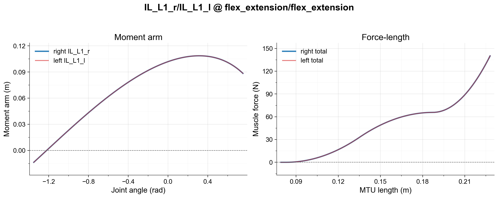

# MyoTorso

MuJoCo musculoskeletal model of the human torso (lumbar spine and abdomen), derived from the Constrained Lumbar Spine model - 210 on SimTK.

## Anatomical scope

| Property | Value |
|---|---|
| Degrees of freedom | 18 |
| Actuators (muscles) | 210 |
| Body segments | Abdomen, Arm_attachment, cervical_spine, chest_r, head_attach, lumbar1, lumbar2, lumbar3, lumbar4, lumbar5, sacrum, torso |
| Primary joints | L1_L2_AR, L1_L2_FE, L1_L2_LB, L2_L3_AR, L2_L3_FE, L2_L3_LB, L3_L4_AR, L3_L4_FE, L3_L4_LB, L4_L5_AR, L4_L5_FE, L4_L5_LB, flex_extension, lat_bending, axial_rotation, Abs_r3, Abs_t1 (locked), Abs_t2 (locked) |

## Reference model

- **Source:** [Constrained Lumbar Spine model - 210](https://simtk.org/projects/lumbarspine)
- **Paper:** Walia et al., 2025. MyoBack: A Musculoskeletal Model of the Human Back with Integrated Exoskeleton. IROS 2025. ([IEEE](https://ieeexplore.ieee.org/document/11063132))

## Fidelity

Moment arm symmetry between left and right muscle groups has been validated for a representative subset of the 210 muscles; full quantitative results are reported in Walia et al. 2025. Note that the model was adjusted after publication — see Manual adjustments.



Example fidelity check (IL_L1 left/right moment-arm and force-length plot) for symmetry and muscle jumping for torso. The full torso muscle check can be run with `tests/debug_muscle_torso.py`.

## Known limitations

- [ ] #52 — Flexors - Extensor flipping
- [ ] #51 — Improve passive dynamics of torso

## Manual adjustments

- Adjustments post conversion to optimize for kinematic and dynamic behaviors are detailed in the ICORR 2025 paper (see Citation).
- Wrapping surfaces are stable against flipping tendons at every range of motion.
- Contact geometries manually designed with references; contact properties optimized for contact-rich behaviors.

## Changelog

**2026-08-02** — Restored anatomical optimal fiber length (`L0`) and tendon slack length (`LT`) from Lumbar_C_238.osim for 15 of 16 severely-inflated muscles (`L0` 5-30x anatomical) and 5 additional moderately-inflated muscles (`EO4`, `IL_R5`, `LTpT_T5`, `Ps_L1_VB`, `QL_ant_I.2-T12`, `MF_m2t.1`, `MF_m3t.1`, `MF_m3t.2`, `MF_m3t.3`, `MF_m4.laminar`, `MF_m4s`, `MF_m5s`, `Ps_L1_L2_IVD`, `QL_mid_L3-12.2` and `LTpL_L4` with a documented compromise). `QL_post_I.3-L3` was left unfixed — its own `lengthrange[0]≈1cm` looks non-physiological and needs remeasurement, not a parameter retune. A broader ~80-muscle tier of less-severe `L0` inflation (ratio 1.2-5x) remains, deliberately deferred. Verified against `myoTorsoPoseFixed-v0` in myosuite4 (random-action rollout, no NaN/instability). See `docs/wiki/log.md` (2026-08-02 entries) for full detail and the per-muscle rationale.

**2026-06-05** — Moved chest ownership to myotorso; added unit tests.

**2026-06-04** — Removed deprecated myolegs_abdomen from fragment catalog and registry; introduced passive torso model loading functions; refactored myotorso to use one model and remove joints.

**2026-06-03** — Refactored model structure and enhanced asset management.

## Citation

```bibtex
@inproceedings{Walia2025,
  title     = {MyoBack: A Musculoskeletal Model of the Human Back with Integrated Exoskeleton},
  author    = {Walia, Rohan and Garzon, Kevin and Billot, Morgane and Subramanian, Swathika and Wang, Huiyi and Refai, Mohamed Irfan and Durandau, Guillaume},
  booktitle = {2025 IEEE/RSJ International Conference on Intelligent Robots and Systems (IROS)},
  year      = {2025},
  url       = {https://ieeexplore.ieee.org/document/11063132},
}
```
